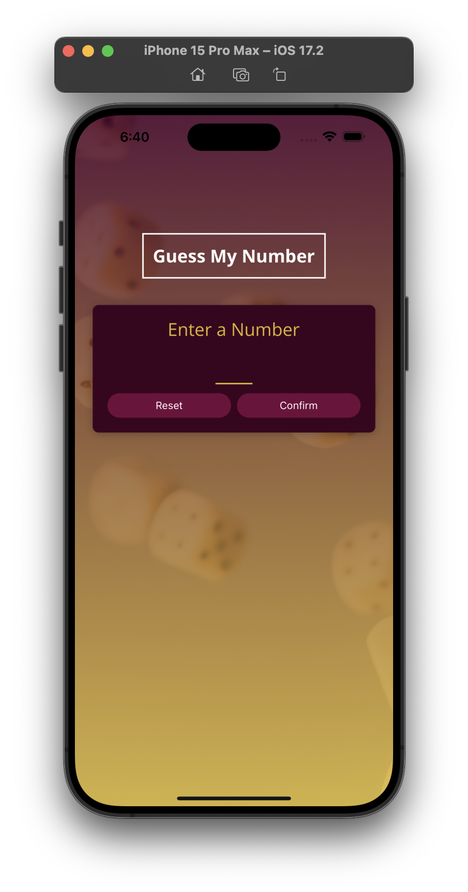
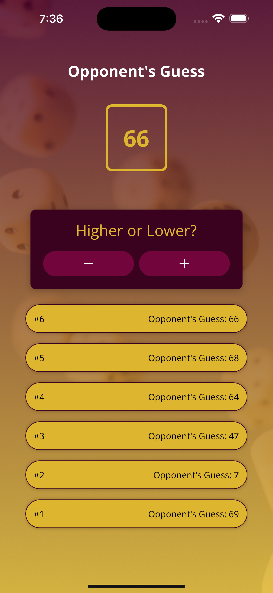

# React Native Number Guess Game

Welcome to the Number Guess Game - a simple mobile game built with React Native. Challenge yourself and see if you can guess the correct number within the given range!

## Features

- **Guess the Number:** Try to guess the correct number within the specified range.
- **Hints:** Receive hints if your guess is too high or too low.
- **Game History:** View the history of your guesses.
- **Reset and Restart:** Reset the game and start a new round.

## Screenshots

Include a few screenshots or GIFs demonstrating the app's user interface and key features.





## Acknowledgements

- [ReactJS](https://react.dev)
- [React Native](https://reactnative.dev/)
- [Expo](https://expo.dev/)

## How to Start the Project

Follow these steps to run the Number Guess Games on your local machine:

**Note**: Make sure Android studio install in your local machine then using android emulator run app on your emulator.

1. **Clone the Repository**:
   Clone this repository to your local machine using the following command:

   ```bash
   git clone https://github.com/kabhinav577/number-guess-game.git
   ```

2. Navigate to the Project Directory:

   ```
   cd number-guess-game

   ```

3. Install Dependencies:

   ```
   npm install

   ```

4. Start the Development Server:

   ```
   npm start

   ```

5. Access the App:

   Download Expo go from play store and Scan **Expo Qr Code** in Expo go app.

## Authors

- [@krishna Kant singh](https://krishnakant-singh.vercel.app/)
